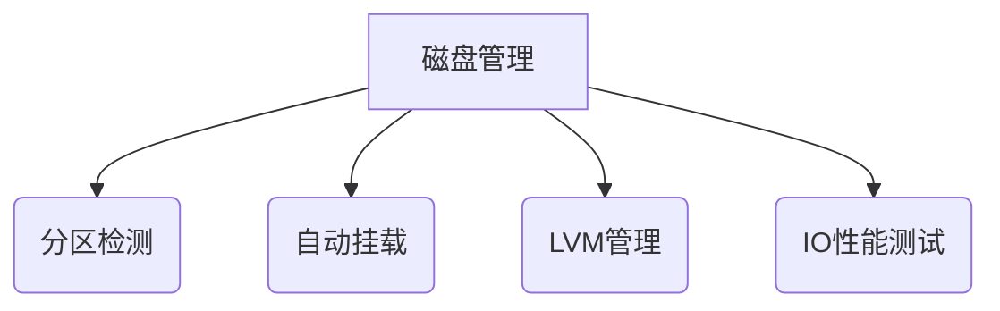

# 搜码Linux工具箱

 


## 📦 项目简介

专为Linux服务器开发的全栈运维工具箱，集成系统管理、磁盘操作、软件安装等核心功能，兼容主流通用Linux发行版。采用中文交互界面设计，支持自动化异常处理机制，通过统一脚本适配不同发行版环境。

### 🏆 核心优势
• **中文交互界面**：降低非英语用户使用门槛
• **自动化异常处理**：智能识别系统环境并自动修复常见错误
• **跨发行版兼容**：支持CentOS/RHEL/Ubuntu/Debian等主流系统

## 🚀 快速安装

```bash
# 一键安装命令（推荐root权限执行）
curl -k -o install.sh https://souma.net/Linux/Linux.sh && chmod +x install.sh && bash install.sh
```

⚠️ **注意事项**：
1. 安装前请验证脚本来源可靠性
2. 建议在干净系统环境下执行
3. 支持网络代理配置（需提前设置环境变量）

## ✨ 功能体系

### 🖥️ 系统管理模块
• 服务器重启/关机控制
• SSH端口动态修改（支持端口冲突检测）
• 用户密码安全策略管理
• NTP时间同步（内置上海时间服务器节点）

### 💾 磁盘管理模块


### 📦 软件管理模块
• 多源智能切换（自动选择最优镜像源）
• 常用工具链安装（wget/curl/vim等）
• 可视化软件仓库管理
• 第三方应用部署（如宝塔面板等）

## 📜 更新日志

### v1.0.1 - 2025.02.03
• 修复磁盘分区识别异常问题
• 优化wget安装失败处理流程
• 增强NTP服务兼容性（支持chrony/ntpd双模式）

### v1.0.0 - 2025.02.02
• 基础框架搭建
• 核心功能模块开发
• 多发行版适配测试

## 📄 协议声明
本项目采用 [GPL-3.0协议](https://www.gnu.org/licenses/gpl-3.0.html) 开源，欢迎二次开发但需保留原始声明。

## 🌐 相关链接
• [速拓云计算平台](https://sutuoc.com)

> 提示：本工具持续迭代更新，建议定期获取最新功能